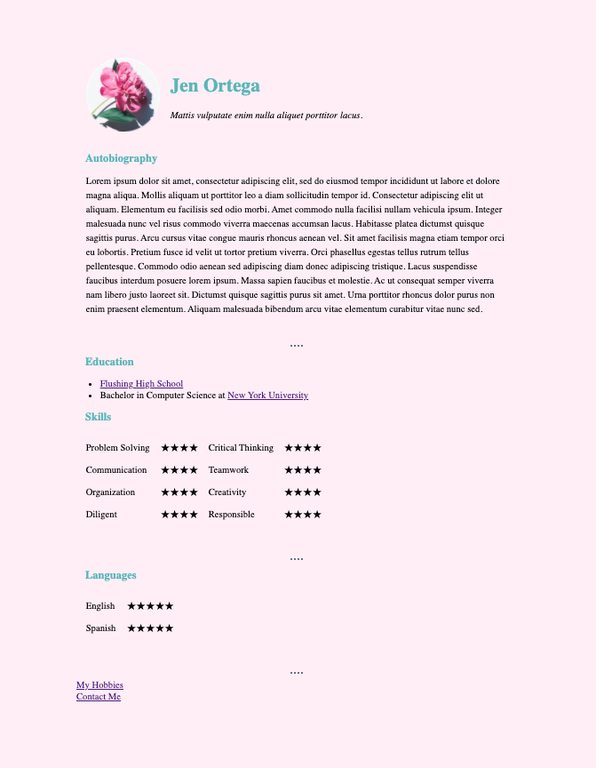

# My CV 
> A simple CV web page created with HTML and CSS.
 
## Table of contents
* [General info](#general-info)
* [Screenshots](#screenshots)
* [Technologies](#technologies)
* [Status](#status)
* [Inspiration](#inspiration)
* [Contact](#contact)
 
## General info
The purpose of this project was to apply what I have learned about HTML and CSS. This project started off only with HTML, but with time, I applied styles with CSS. Moreover, this is my first project within the web development world. 
 
## Screenshots

 
## Technologies
* HTML5
* CSS3
 
## Status
The project is no longer continuing as I continue to learn other languages. However, this might be one of the projects in which I will be applying any learned information about HTML and CSS. 
 
## Inspiration
This web page is based on The App Brewery’s “The Complete Web Development Bootcamp”. 
## Contact
Created by me. Please let me know if you have any questions. 
